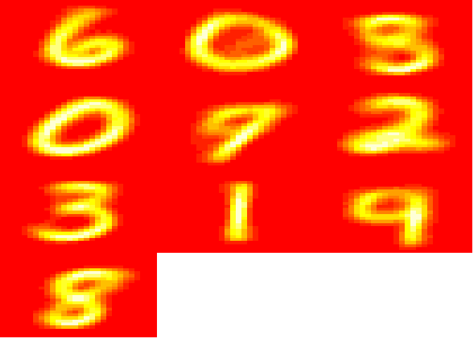

Bernoulli Mixture Models
------------------------

This package provides a fast implementation modelling a mixture of
multivariate bernoulli samples. Expectation Maximization is used to find
the multivariate bernoulli prototypes and their mixture weights that
maximize the likelihood of the data.

The main function, `BMM`, works with both dense matrices and sparse,
pattern matrices from the `Matrix` package that ships with most
installations of `R`

### Example Usage

We will first train a model on synthetic data generated from two very
specific prototypes and mixing weights. It is our hope that given the
generated data, the model can uncover the prototypes and mixing weights.

    P1 <- c(0.9, 0.9, 0.9, 0.1, 0.1)
    P2 <- c(0.1, 0.1, 0.9, 0.9, 0.9)

    prototypes <- list(P1, P2)
    weights <- c(0.25, 0.75)

    x <- t(replicate(1000, {
      
      ## pick a random prototype
      i <- sample(1:2, size = 1, prob =  weights)
      
      ## sample bits from the chosen prototype
      sapply(prototypes[[i]], function(p) rbinom(1, 1, p))
      
    }))

    head(x)

    ##      [,1] [,2] [,3] [,4] [,5]
    ## [1,]    1    1    1    0    1
    ## [2,]    0    0    1    1    1
    ## [3,]    0    0    1    1    1
    ## [4,]    0    0    1    1    1
    ## [5,]    0    1    1    0    1
    ## [6,]    0    0    1    1    1

Training a BMM
--------------

To train a BMM model invoke the BMM method passing the binary matrix of
data, the number of clusters to model, the maximum number of EM updates,
and whether to print training information to the console:

    set.seed(1234)
    res <- BMM(data = x, K = 2L, max.iter = 20L, verbose = 1L)

    ##     0 |      -4155.3022
    ##     1 |      -3454.8290
    ##     2 |      -3454.7546
    ##     3 |      -3454.2607
    ##     4 |      -3450.9914
    ##     5 |      -3429.9209
    ##     6 |      -3313.7880
    ##     7 |      -2956.5027
    ##     8 |      -2593.1706
    ##     9 |      -2449.3920
    ##    10 |      -2371.0938
    ##    11 |      -2325.7450
    ##    12 |      -2303.7729
    ##    13 |      -2292.8449
    ##    14 |      -2286.8891
    ##    15 |      -2283.4879
    ##    16 |      -2281.5120
    ##    17 |      -2280.3530
    ##    18 |      -2279.6672
    ##    19 |      -2279.2582

At each iteration, the model will print the log likelihood if the
verbose option is requested. The model will stop training after
convergence or the max number of iterations is reached, whichever
happens first. A model converges when the log likelihood no longer
updates.

Once the model finishes training it will return a list with three
elements:

1.  prototypes - contains a `K x ncol(data)` matrix where each row
    represents one of the learned prototoypes.
2.  pis - A numeric vector of length K containing the mixing weights
3.  cluster - An integer vector of length `nrow(data)` indicating which
    prototype was most likely to have generated each data point.

<!-- -->

    ## Multivariate Bernoulli prototypes
    print(round(res$prototypes, 2))

    ##      [,1] [,2] [,3] [,4] [,5]
    ## [1,] 0.11 0.12 0.92 0.89 0.90
    ## [2,] 0.87 0.92 0.90 0.14 0.14

    ## mixing weights
    print(round(res$pis, 2))

    ## [1] 0.74 0.26

These results are very similar to the prototypes and mixing weights used
to generate the dataset!

MNIST
-----

What about something a little more interesting? The following example
trains a BMM on a sample of the famous MNIST, hand-written digit
dataset.

    url <- "http://yann.lecun.com/exdb/mnist/t10k-images-idx3-ubyte.gz"
    tmp <- tempfile()
    download.file(url, tmp)
    to.read <- gzfile(tmp, open = "rb")

    ## file header info
    readBin(to.read, what=integer(), n=4, endian="big")

    ## [1]  2051 10000    28    28

    images <- sapply(seq.int(10000), function(x) {
      readBin(to.read,integer(), size=1, n=28*28, endian="big")
    })

    close(to.read)

    d <- t(images)
    d <- (d < 0) + 0L ## binarize

    res <- BMM(d, K=12L, max.iter = 50L, verbose = 0L)

### Visualizing Prototypes

With the BMM trained on the MNIST data we can now visualize the
prototypes to see what the model uncovered:

    par(mfrow=c(4,3))
    par(mar=c(0,0,0,0))
    for (i in seq.int(10)) {
      image(matrix(res$prototypes[i,], 28, 28)[,28:1], axes=F)
    }
    par(mfrow=c(1,1))

